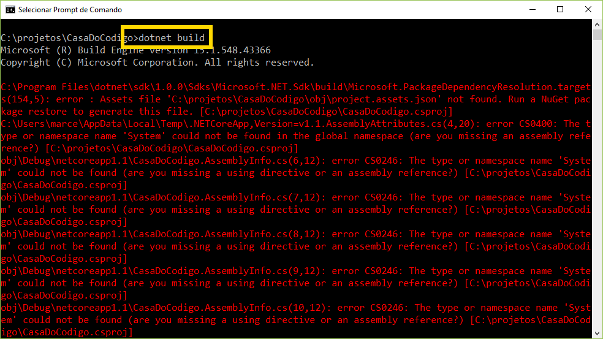

# Problemas em Pacotes da Solução

Você acabou de criar um projeto ASP.NET Core MVC utilizando linha de comando. 
Ao compilar o projeto com o comando `dotnet build`, várias mensagens de erro são exibidas:	

Qual a medida necessária para que o projeto compile com sucesso?

a. 

Em vez de `dotnet build`, é preciso rodar o comando `dotnet install`

b.

A imagem indica que você não criou o tipo de projeto correto. Recrie um novo projeto com template do ASP.NET Core MVC.

c.

Antes de rodar `dotnet build`, é preciso antes restaurar os pacotes NuGet do projeto com `donet restore`.

d.

Como se vê pela imagem, está faltando o arquivo `project.assets.json`. Crie este arquivo e inclua todos os pacotes necessários para execução do projeto ASP.NET Core MVC.
